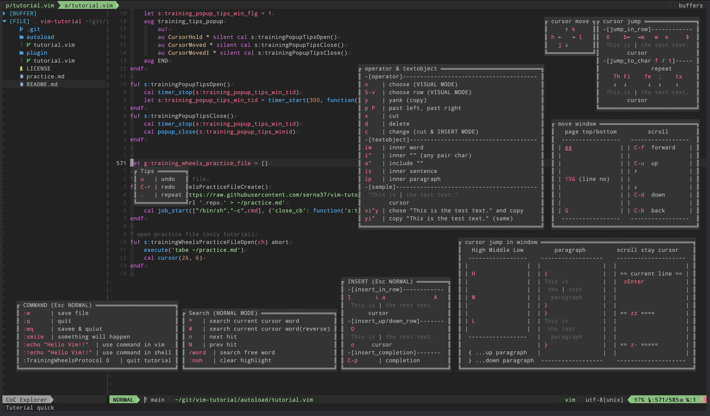

# vim-tutorial
tutorial animation on vim

demo


demo(quick mode)


# Usage
```vim
" run
:Tutorial

" stop
:Tutorial deactive

" without movie, only popup
:Tutorial quick

" close ALL popup
:TutorialPopupclear
```
